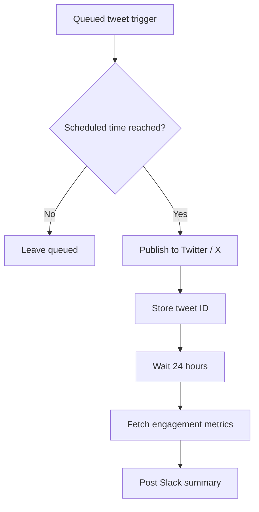

# Tweet Scheduler & Engagement Tracker

Posts tweets at their scheduled time and reports back likes/retweets/replies 24 hours later.

  


---

**[Open the visual project page →](./index.html)**

## Table of Contents

- [Overview](#overview)
- [Architecture](#architecture)
- [Workflow](#workflow)
- [Tech Stack](#tech-stack)
- [Demo status](#demo-status)
- [Setup](#setup)
- [Repository Structure](#repository-structure)
- [Disclaimer](#disclaimer)

## Overview

**Trigger:** Webhook (tweet schedule: scheduled_date, time, content, media_url)

Posts tweets at their scheduled time and reports back likes/retweets/replies 24 hours later.

### Key Features

- Time-gated scheduled posting
- 24h-delayed engagement tracking
- Slack performance summary

## Architecture

The diagram below represents the sanitized template flow. External services, credentials, and environment-specific identifiers must be configured before execution.



## Workflow

1. Tweet schedule trigger receives the queued post
2. Check whether the current time matches the scheduled time
3. At the right time: post to Twitter/X and track the tweet ID
4. Wait 24 hours, then fetch engagement metrics
5. Post a Slack summary of likes, retweets, and replies

## Tech Stack

- n8n
- Twitter/X API v2
- Slack

## Demo status

A configured live-run recording is not included yet. Credentials and service identifiers remain placeholders.


## Setup

1. Import `workflow/T26_Tweet_Scheduler_Engagement.json` into your n8n instance (**Workflows → Import from File**).
2. Replace every placeholder credential/URL in the workflow (e.g. `YOUR_..._API_KEY`, `YOUR_..._URL`) with your own service credentials.
3. Activate the workflow and point the relevant integration (webhook source, scheduled trigger, etc.) at the generated webhook URL.
4. Test with a sample payload before going live.

## Repository Structure

```text
.
├── index.html
├── README.md
├── LICENSE
├── .gitignore
└── workflow/
    └── T26_Tweet_Scheduler_Engagement.json
```


## Disclaimer

This workflow was built as a portfolio/template project to demonstrate n8n workflow automation and AI integration. API credentials and sensitive configuration have been removed before publication — replace all `YOUR_..._KEY` / `YOUR_..._URL` placeholders with your own before use.

---

Designed and engineered by

**Oyekola Ololade**

AI Systems & Integration Engineer

- LinkedIn: <http://linkedin.com/in/ololade-oyekola-5b1797397>
- Email: <oyekolaololade69@gmail.com>
